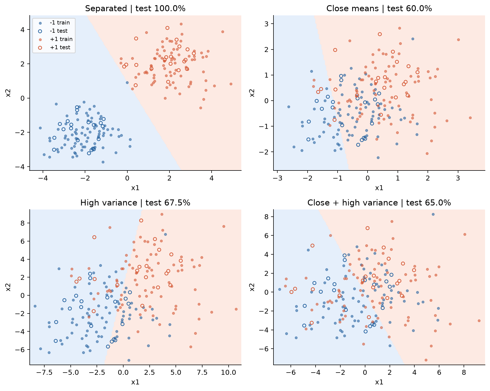
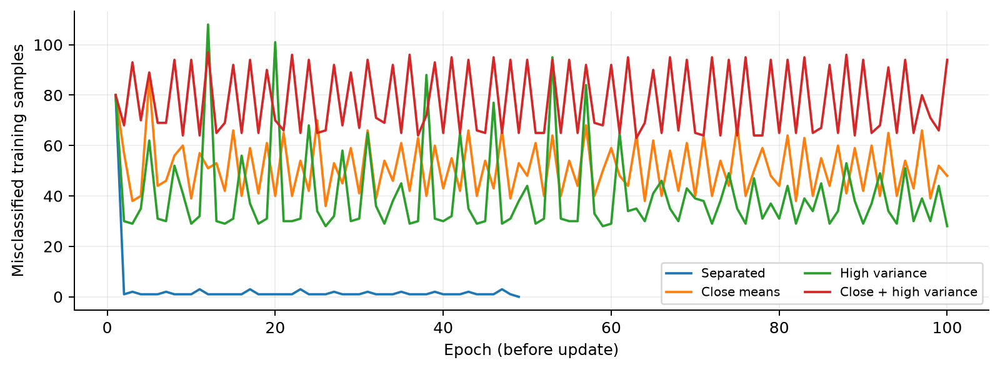
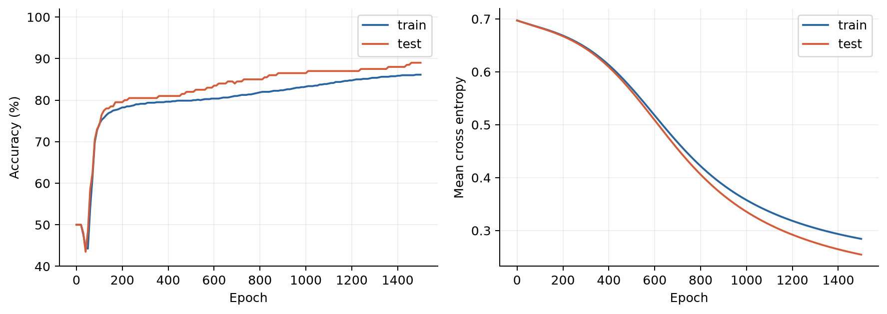
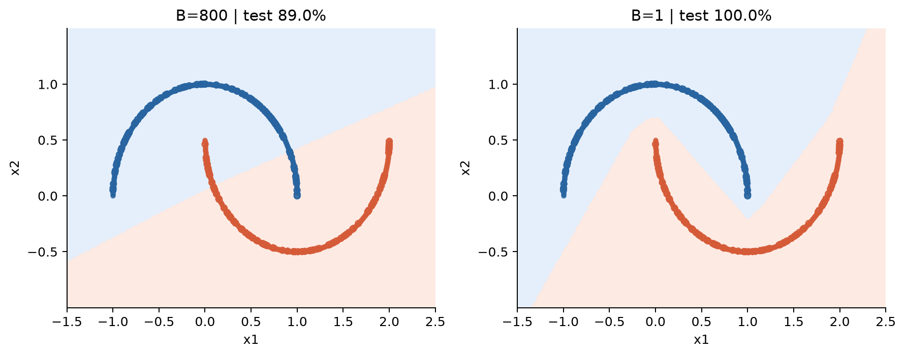
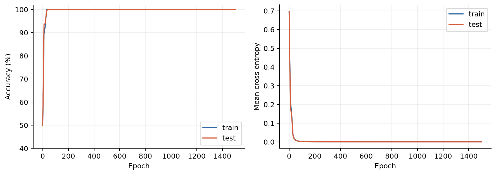
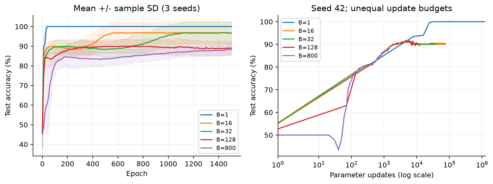
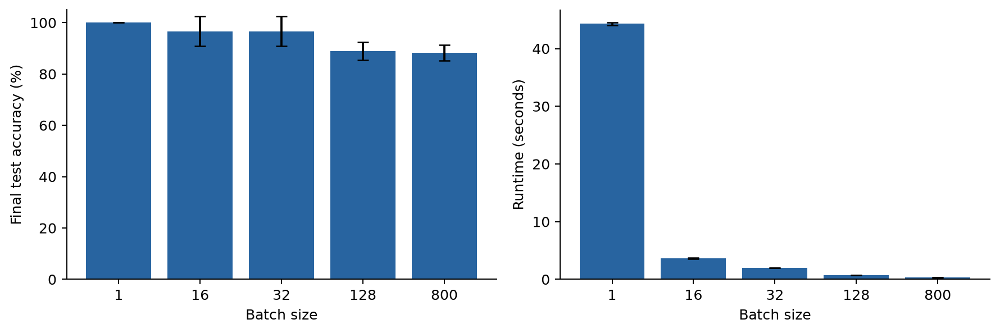

CS324 · Deep Learning

Assignment 1 实验报告

感知机、多层感知机与不同批次大小的梯度下降

学号：12411103    |    实现：Python / NumPy

摘要

本作业从二维二分类出发，手工实现单神经元感知机、包含 ReLU 与 Softmax 的多层感知机，以及全批量、随机和小批量梯度下降。感知机在四种高斯分布条件下进行10次重复实验；MLP 在双月数据上以五种 batch size、三个随机种子进行比较。所有表格与图像来自随附代码的实际运行。

种子42下，基准感知机的测试准确率为100%；默认全批量 MLP 为89.00%，SGD 为100.00%。后两者训练轮数均为1500，但参数更新次数分别为1,500和1,200,000。结果体现了数据可分性、优化预算与批次大小的共同影响，不能仅根据最终准确率断言某种算法总是更优。

任务覆盖与报告结构

| 部分 | 完成内容 | 主要证据 |
| --- | --- | --- |
| Part I · 20分 | 二维高斯数据、感知机实现、测试、均值/方差实验 | 表1-2、图1-2 |
| Part II · 65分 | NumPy MLP、随机划分、默认参数训练 | 公式、表3、图3-4 |
| Part III · 15分 | SGD开关、训练/测试曲线、batch size比较 | 表4-5、图5-7 |

统一实验规范

测试集只用于评估，不参与梯度更新，不用于选择训练轮数、初始化或最优 checkpoint。本文报告预先固定的末轮结果；保留表现一般的默认参数基准。主图使用种子42；MLP重复实验使用42/43/44，感知机使用42至51。误差条均为样本标准差（ddof=1），不是置信区间。

交付物包含：完整代码、已执行的 Jupyter Notebook、PDF与可编辑Markdown报告、原始结果、数据划分、运行说明与自动验证测试。无需GPU或下载外部训练数据。


---

Part I · 感知机的理论与实现

1.1 模型与整批学习规则

感知机只有一个计算神经元。二维样本先计算线性得分，再输出 -1 或 +1；得分为0时按教程归为 +1。偏置并入权重最后一维，训练从全零权重开始。令 M 为本轮误分类样本的集合，每轮只更新一次。

```text
score = w1*x1 + w2*x2 + b
y_hat = +1 if score >= 0 else -1
x_aug = [x1, x2, 1];  theta = [w1, w2, b]
M = {i : y_hat_i * y_i < 0}
gradient = -mean(y_i * x_aug_i for i in M)
theta <- theta - learning_rate * gradient
```

学习率0.01，最多100轮。M为空时直接停止以避免除零。forward支持单样本与批量样本，train按误分类样本数求平均，而不是按全部训练样本数求平均。误分类数在每轮更新前记录。

1.2 数据生成与控制变量

每类从二维正态分布独立采样100点，类内随机打乱后取80点训练、20点测试，再将两类合并并同步打乱特征与标签。训练/测试总量为160/40，两部分无重用样本。四种条件共享同一随机种子及生成步骤；协方差均为 variance × I。

| 条件 | 负类均值 / 正类均值 | 每坐标方差 |
| --- | --- | --- |
| A 基准分离 | (-2,-2) / (2,2) | 1 |
| B 均值接近 | (-0.5,-0.5) / (0.5,0.5) | 1 |
| C 高方差 | (-2,-2) / (2,2) | 9 |
| D 接近且高方差 | (-0.5,-0.5) / (0.5,0.5) | 9 |

表1：Task 1与Task 4的数据设置。均值差4和1指每个坐标的差值；相应欧氏距离为4√2和√2。

1.3 测试结果与重复实验

| 条件 | 训练%(42) | 测试%(42) | 测试%均值±SD | 零误差收敛 |
| --- | --- | --- | --- | --- |
| A | 100.00 | 100.00 | 99.50 ± 1.05 | 10/10 |
| B | 62.50 | 60.00 | 66.75 ± 8.66 | 0/10 |
| C | 72.50 | 67.50 | 75.00 ± 8.74 | 0/10 |
| D | 58.75 | 65.00 | 50.25 ± 9.31 | 0/10 |

表2：单次结果与10个种子统计。基准种子42在第49轮检查时误分类为0，实际执行48次更新；其权重 [w1,w2,b] = [0.0424473, 0.0211133, -0.0200000]。其余三条件的主实验均运行至100轮。


---

Part I · 数据重叠与训练行为





均值靠近或方差增大会增加两类重叠。重复实验中，基准平均测试准确率99.50%，均值接近为66.75%，高方差为75.00%，两者同时改变为50.25%。固定学习率下，纠正一组误分类点可能使另一组点变错，导致边界振荡。

高斯总体具有无界支撑；有限样本可线性可分，但不能据此断言两个总体完全不重叠。100轮未收敛也不是不可分的数学证明。总体重叠存在不可约误差，增加非线性并不能保证完美分类。


---

Part II · 多层感知机与反向传播

2.1 网络结构与数据

使用 make_moons 生成1000个二维点，无额外噪声；按类别分层随机划分800个训练点和200个测试点，每部分各类数量均衡。标签编码为[1,0]或[0,1]。网络为2→20→2，共102个可训练参数。隐藏层采用ReLU，输出层采用Softmax。n_hidden也支持多个隐藏层；训练基准严格保留模板的一层20单元。

模板没有给定初始化方差、噪声和种子，因此本实现明确采用 N(0,0.1^2) 权重、零偏置、noise=0、seed=42。数据保持原坐标，不标准化。所有矩阵运算与梯度均手工用NumPy实现；scikit-learn仅用于数据生成和划分。

2.2 前向传播与维度约定

批次样本按行存放，输入X形状为(B,d_in)，W为(d_in,d_out)，b为(d_out,)。与题面列向量公式等价，只是采用转置后的数据布局。

```text
Z = X @ W + b
A = maximum(Z, 0)                 # hidden layers
U = Z_out - max(Z_out, axis=1)
P = exp(U) / sum(exp(U), axis=1)  # output probabilities
L = -sum(Y * log(P)) / B
```

Softmax先减去每行最大值以避免指数溢出。损失取批次平均，log输入下限为浮点数的最小正规正数。每个模块缓存最近一次前向传播所需数据，反向传播必须紧接训练批次的前向传播完成。

2.3 反向传播与参数更新

```text
dZ_out = (P - Y) / B             # fused softmax + cross entropy
dW = X.T @ dZ
db = sum(dZ, axis=0)
dX = dZ @ W.T
dZ_hidden = dA * (Z_hidden > 0)
W <- W - 0.01 * dW;  b <- b - 0.01 * db
```

CrossEntropy.backward直接返回logits梯度，因此MLP.backward跳过Softmax，避免重复求导。均值归一化只在融合梯度除以B一次，Linear层不重复平均。独立SoftMax.backward也完整实现：P × (G - sum(G × P))，用于一般上游概率梯度。

2.4 正确性验证

对一个2→4→3→2网络的全部权重与偏置做中心差分检查，差分步长1e-6，解析梯度与数值梯度的最大绝对误差为7.637e-11。其余验证覆盖Softmax极端输入、ReLU导数、随机划分、整批感知机更新、批次尾部样本，以及替换测试数据后训练权重保持不变。


---

Part II · 默认参数的全批量实验

| 参数 | 设置 | 参数 | 设置 |
| --- | --- | --- | --- |
| 隐藏层 | 20单元 / ReLU | 学习率 | 0.01 |
| 训练轮数 | 1500 epoch | batch size | 800 |
| 评估频率 | 每10轮及epoch 0 | 损失 | 平均交叉熵 |

表3：模板默认参数。max_steps沿用模板参数名，其语义为完整epoch。每轮对800个训练点执行一次更新。



训练准确率从50.00%提高到86.125%，测试准确率从50.00%提高到89.00%。最终训练/测试损失分别为0.284305/0.254501，测试集正确178/200。



全批量模型学习到分离双月的大致趋势，但弯曲区域仍有错误。训练/测试差距不大，且训练集自身尚未完全拟合，说明当前优化预算下仍有拟合空间。测试准确率略高于训练准确率可能来自有限样本划分差异，不代表使用了测试数据训练。


---

Part III · SGD实现与单次比较

3.1 统一训练循环

train新增batch_size参数：不传值为全批量，1为SGD，中间值为小批量。每轮用同一种子流打乱训练集，按批切片并依次前向、反向、更新。最后不足一个批次的样本仍参与训练，并按实际批大小计算平均梯度。每10轮在完整训练集和测试集上评估。



SGD最终训练/测试准确率均为100.00%，损失分别为0.00007475/0.00008065。测试混淆矩阵为[[100,0],[0,100]]（行是真实类别，列是预测类别）。这一结果针对无噪声双月数据，不应推广为带噪数据的必然结果。

| 批大小 | 更新次数 | 训练% | 测试% | 测试损失 | 耗时/s |
| --- | --- | --- | --- | --- | --- |
| 1 | 1,200,000 | 100.000 | 100.00 | 0.000081 | 44.07 |
| 16 | 75,000 | 89.125 | 90.00 | 0.187117 | 3.74 |
| 32 | 37,500 | 89.250 | 90.00 | 0.186706 | 1.96 |
| 128 | 10,500 | 89.000 | 90.50 | 0.187752 | 0.76 |
| 800 | 1,500 | 86.125 | 89.00 | 0.254501 | 0.37 |

表4：固定种子42、相同1500个epoch的末轮结果。耗时包含周期评估，不含画图、保存和Python启动。

3.2 比较中的关键限制

所有设置都遍历120万个训练样本，但执行的更新次数相差很大。B=128每轮为7次更新，其中末批仅32点，故总计10,500次，而不是9,375次。相同epoch不是相同更新预算，SGD更高的准确率不能全部归因于梯度噪声或所谓“跳出局部最优”。本实验也没有证明全局最优。

SGD每次更新工作量少，但Python逐样本循环多，在本次CPU实现中总耗时最长。固定每10轮的评估曲线会隐藏批次间的瞬时波动，不能凭图5平滑就断言SGD梯度没有噪声。


---

Part III · 重复实验与结果分析

| 批大小 | 测试准确率均值±SD / % | 耗时均值±SD / s |
| --- | --- | --- |
| 1 | 100.00 ± 0.00 | 44.29 ± 0.20 |
| 16 | 96.67 ± 5.77 | 3.66 ± 0.07 |
| 32 | 96.67 ± 5.77 | 1.97 ± 0.02 |
| 128 | 89.00 ± 3.50 | 0.76 ± 0.00 |
| 800 | 88.33 ± 3.06 | 0.36 ± 0.01 |

表5：种子42/43/44；每个种子下各批大小共享数据划分、初始权重和逐轮shuffle流。





B=16与32在种子42的测试准确率均为90%，种子43和44均达到100%，均值96.67%。这说明单次实验不足以刻画稳定性；此处种子同时改变数据划分和初始化，无法单独归因于其中一项。B=1三次均为100%，但成本明显更高；B=800平均88.33%，耗时最低。

在本次固定学习率与训练轮数下，小批次提供更多更新机会；中等批次降低循环成本。最终选择取决于准确率、稳定性和运行成本，而不是只看batch大小。这里只做三个种子和一个无噪声数据任务，无法据此得出普遍最优batch size；下一步可固定更新次数或运行时间再比较。


---

复现说明、任务核对与结论

4.1 从压缩包复现

解压12411103_assignment1.zip，在README所在目录打开终端，执行下列命令。完整实验无需网络访问或GPU；仅首次安装依赖可能需要联网。

```text
python -m pip install -r requirements.txt
python -B -m unittest discover -s tests -v
python -B run_experiments.py
python build_notebook.py
```

Notebook默认展示随包保存的真实结果，并重跑感知机与验证测试。设置RECOMPUTE=True可在Notebook中重新训练全部实验。单独运行训练脚本时，--batch_size 800为全批量，--batch_size 1为SGD；未传该参数也默认全批量。

4.2 环境与验证

实际实验环境：Python 3.14.6，NumPy 2.5.3，scikit-learn 1.9.0，Matplotlib 3.11.2。全部8项测试通过。训练使用float64；结果、最终权重、混淆矩阵和数据划分分别保存在JSON/NPZ中。固定种子可复现主要数值，运行时间随机器负载改变，不应要求完全一致。

| 作业项 | 交付文件 / 证据 |
| --- | --- |
| Part I Task 1-4 | Part_1/*.py；Notebook Part I；表1-2、图1-2 |
| Part II Task 1-3 | Part_2/*.py；Notebook Part II；表3、图3-4 |
| Part III Task 1-2 | batch_size参数；Notebook Part III；表4-5、图5-7 |
| 报告、代码、运行说明 | report_12411103.pdf；全部源码；README.md；requirements.txt |

4.3 结论

单层感知机通过线性边界完成分离良好的高斯二分类，但数据重叠后持续存在误分类；MLP通过非线性隐藏层能够表达双月边界。默认全批量实验保留了有限训练预算下的不完全拟合结果，SGD在本任务取得更高准确率，同时付出更多更新和运行时间。重复实验揭示了中等批次结果的种子差异。

参考与来源

[1] CS324: Deep Learning, Assignment 1, Jianguo Zhang, 2025-09-25。任务要求与提交规范。
[2] 配套感知机教程与perceptron.py模板。整批误分类梯度与零分数标签约定。
[3] 配套modules.py、mlp_numpy.py、train_mlp_numpy.py模板。网络结构与默认参数。
[4] 用户提供的dp_hw1_report.pdf。仅参考“理论-实现-结果-分析”的报告结构；数值和结论均重新实验。
